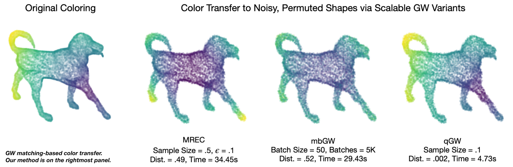
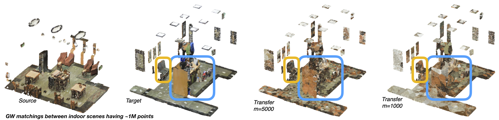

<!--  -->


## Quantized Gromov-Wasserstein

This repository contains the implementations in the paper [_Quantized Gromov-Wasserstein_](https://arxiv.org/abs/2104.02013) by Samir Chowdhury, David Miller, and Tom Needham.

### Installation

We recommend creating a virtual environment to test this code:

```
conda create -n qgw python=3.7
conda activate qgw
pip install -r requirements.txt
```

This installs Jupyter Notebook and Jupyter Lab, either of which can be used to test out the included notebooks.